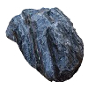
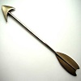
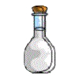

# Game Design Document

## Question 1
>You must tell us what 'things' you will have, how they will move (or not move). What they look like. Including the images in your document is an easy way to show us what they look like.

**Things I will have**

0. Main character: Dragon

1. Obstacle1: rock 

2. Obstacle2: arrow 

3. Obstacle3: fire ball 

4. Red bottle potion: HP potion 

5. White bottle potion: invisible potion 

6. Life: heart 

**How they will move**
>Basicaly, dragon will be controlled by keyboard input; everytime user push arrow keyboards, dragon will move little bit to entered direction.
>Obstacle1, 2, and 3 as well as red and whith bottle potions will have different size, speed, and shape. They are going to be moved by using timer.  

0. Main character, which is a dragon, will be controlled by arrow key on a keyboard.  
1. Obstacle1, which is a rock, will come up continuously and have a slow speed compared to the others.  
2. Obstacle2, which is an arrow, will move faster than rocks.  
3. Obstacle3, which is a fire ball, will have the biggest size among all obstacles and will have moderate speed in the middle between a rock and an arrow.  
4. Red bottle potion, which is a HP potion, will recover dragon's HP. It will come up randomly.  
5. White bottle potion, which is an invisible potion, will make dragon invisible so that any obstacles cannot give a dammage to the dragon while it is invisible.  
6. Life, which indicates dragon's remaining life, will either decrease or increase depending on whether it get the potion or is hit by obstacle.

## Question 2
>Tell us how to play your game. Is it mouse, or keyboard? If mouse, what do you do with the mouse. If keyboard, what key commands are there and what do they do.

User will use keyboard for playing the game. Basically, only arrow keys are required. However, I am thinking to add one more skill that dragon can you when MP is fulled.

## Question 3
>Tell us how the score changes. Can it go down?

The score will be calulated depending on time. The longer time dragon survives, the higher score user will get. It will not go down.

## Question 4
>Tell us how you keep track of a player¡¯s lives. When do they lose one? When do they die?

There will be hearts, which indicate remaining lifes of dragon. Everytime the drgaon is hit by obstacle, life will go down. 
However, when the dragon get a red bottle potion, which will come up randomly, life heart will go up again by one.
Dragon will die when it looses every heart.

## Question 5
>Show us the layout of your user interface. Tell us about menus, buttons, actions, and any other user interface components, and what they do.
>	-You should include pictures of what your interface would look like
>	-A photo of hand-drawn rendering would suffice. It does not need to be computer generated.

At the very first screen, there will be a name of the game, which is `Dragon Flight`, followed by the options.
First option will be `Start Game`, which will be executed by push `Enter` key.
Second option will be `Instruction`. It will explain the game breifly; what kind of obstacles and potions there are, How score will be calculated, When the dragon will die.
Thirde option will be `Show scores`. It wiil have all scores for previous games.