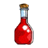
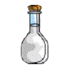

# Game Design Document

## Question 1
>You must tell us what 'things' you will have, how they will move (or not move). What they look like. Including the images in your document is an easy way to show us what they look like.

**Things I will have & What they look like**

0. Main character: Dragon 

1. Obstacle1: rock 

2. Obstacle2: arrow 

3. Obstacle3: fire ball 

4. Red bottle potion: HP potion 

5. White bottle potion: invisible potion 

6. Life: heart 

**How they will move**
Basicaly, dragon will be controlled by keyboard input; everytime user push arrow keyboards, dragon will be moved by entered direction.
Obstacle1, 2, and 3 will have different size, speed, and shape.
As score goes up, not only the type of obstacles will be diversified, but also coming up interval will be faster.
Either red or whith bottle potion will come up randomly every 1000 score and will move straightly from north to south in constant speed.
Hearts(lives) will not move, but will be fixed at the left top of the screen. Five hearts are the maximum number.
Every object that needs to be moved will move by using timer.  

0. Main character, which is a dragon, will be controlled by arrow key on a keyboard.  
1. Obstacle1, which is a rock, will come up continuously and have a slow speed in comparison to the others.  
2. Obstacle2, which is an arrow, will move faster than rocks.  
3. Obstacle3, which is a fire ball, will have the biggest size among all obstacles and will have moderate speed, between a rock and an arrow.  
4. Red bottle potion, which is a HP potion, will recover dragon's HP.  
5. White bottle potion, which is an magic potion, will make dragon be able to use the magic that will eliminate every obstacle in the screen.  
	While eating red potion will increase the number of life upto 5, eating white potion will increase the number of magic available.  
	(Either red or white potion will come up every 1000 score.)  
6. Life, which indicates dragon's remaining life, will either decrease or increase depending on whether it get the potion or is hit by obstacle.
7. Magic, which will be increased by eating white potion, will decrease when user cast the magic by hitting `space' key.

## Question 2
>Tell us how to play your game. Is it mouse, or keyboard? If mouse, what do you do with the mouse. If keyboard, what key commands are there and what do they do.

User will use keyboard for playing the game. Basically, especially for controlling a dragon, arrow keys are only required.  
In addition to controlling a dragon, user can cast the magic by pressing 'space' bar, only if there is magic available.

## Question 3
>Tell us how the score changes. Can it go down?

The score will be calulated depending on time. The longer time dragon survives, the higher score user will get. It will not go down.

## Question 4
>Tell us how you keep track of a player¡¯s lives. When do they lose one? When do they die?

There will be hearts, which indicate remaining lifes of dragon. Everytime the drgaon is hit by obstacle, life will go down. 
However, when the dragon get a red bottle potion life heart will increase up by one.
Dragon will die when it looses every heart.

## Question 5
>Show us the layout of your user interface. Tell us about menus, buttons, actions, and any other user interface components, and what they do.
>	-You should include pictures of what your interface would look like 
>	-A photo of hand-drawn rendering would suffice. It does not need to be computer generated.

1. `User name` box: here is where user will enter a name of user.  
2. `Score` box: here is where user can see his/her score.  
3. `Start` button: pushing this botton will start the game  
4. `Pause/Resume` botton: pushing this botton will be going to either pause or resume the game.  
5. `Quit` button: will execute the program.  
6. `Error/message` box: will display any information that might be wrong or changed etc  
7. `Game` level: will show current level of the game.  
8. `Instruction` box: will show brief instruction for playing the game.  

**Initial screen**

**Playing screen**

